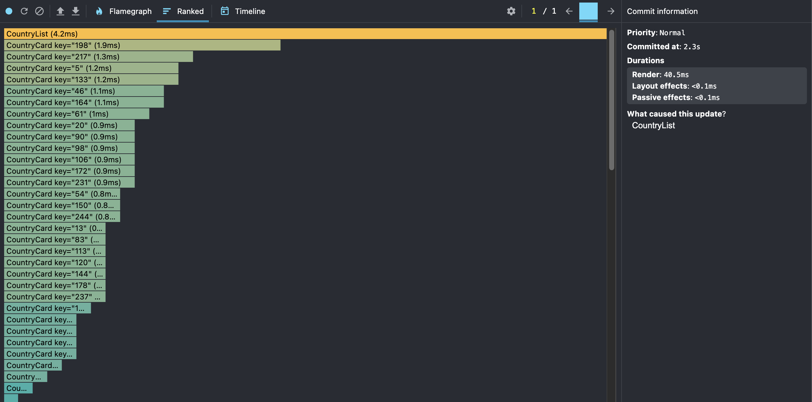
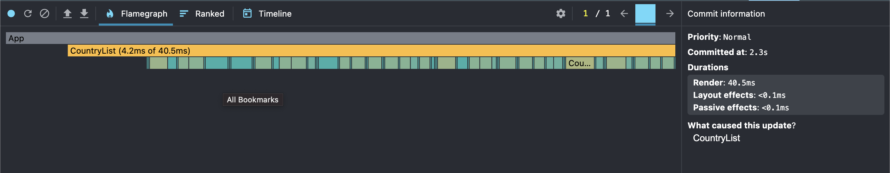
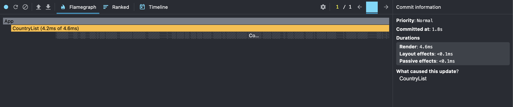
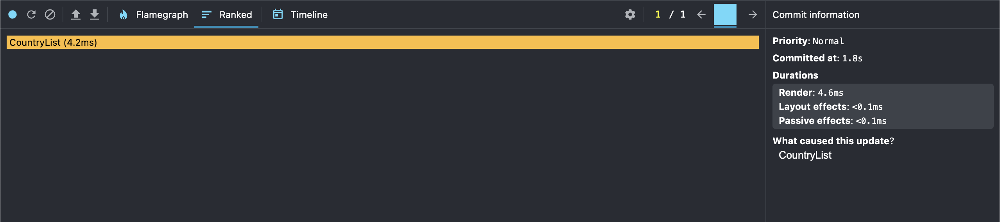

# React Performance

## Getting Started

1. Clone the repository
2. Install dependencies:
   ```bash
   npm install
   ```
3. Start the development server:
   ```bash
   npm run dev
   ```

## Performance Profiling Instructions

1. Open Chrome DevTools (F12)
2. Go to the React tab
3. Select the Profiler
4. Click the Record button
5. Perform the following actions:
   - Sort by population
6. Stop recording
7. Analyze the results in the Flame Graph and Ranked Chart

## Performance Profiling Results

### Before Optimization

- Commit Duration: **2.3s**
- Render Duration: **40.5ms**
- Interactions:
  Sort by population
- Flame Graph: Visual representation of component render times.
  
- Ranked Chart: Sorted list of components by render duration.
  

### After Optimization

- Commit Duration: **1.8s**
- Render Duration: **4.6ms**
- Interactions:
  Sort by population
- Flame Graph: Visual representation of component render times.
  
- Ranked Chart: Sorted list of components by render duration.
  

### Comprassion Parameters

- **88.8%** reduction in render time
- **21.7%** reduction in commit duration
- Optimized component tree with memoized values and callbacks
